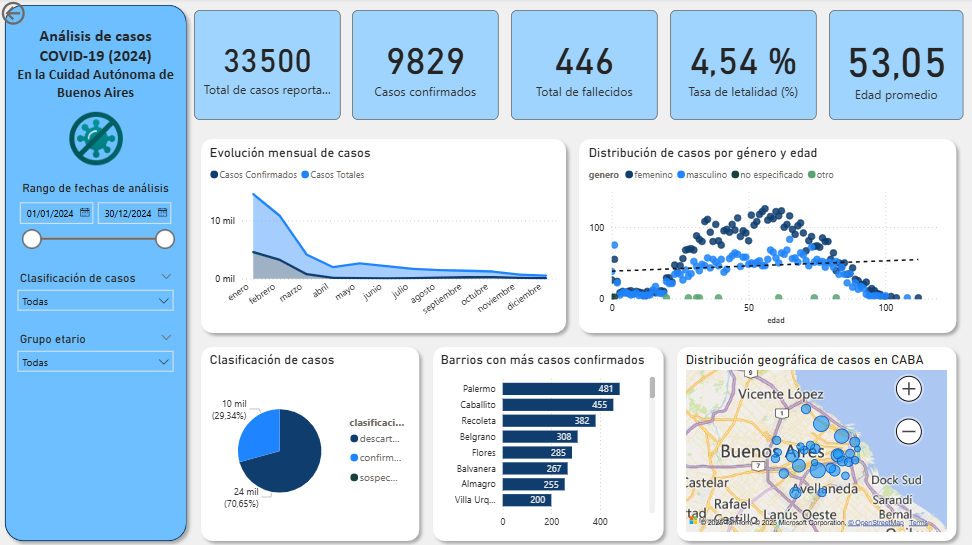

# Análisis de Casos COVID-19 en la Ciudad Autónoma de Buenos Aires (2024)

## Tabla de Contenidos
1. Introducción  
2. Objetivos  
3. Herramientas Utilizadas  
4. Transformación de Datos (Power Query)  
5. Análisis  
6. Hallazgos  
7. Recomendaciones  
8. Conclusión  
9. Fuente de Datos  

---

## 1. Introducción
Este proyecto analiza los casos de COVID-19 reportados en la Ciudad Autónoma de Buenos Aires durante el año 2024.  
Se construyó un **dashboard interactivo en Power BI** que permite explorar la evolución mensual de casos, indicadores clave, distribución por edad y género, clasificación de casos y concentración por barrios.  

---

## 2. Objetivos
- Analizar la evolución de los casos confirmados a lo largo del año.  
- Calcular indicadores clave: tasa de letalidad y edad promedio.  
- Estudiar la distribución de casos por género y grupo etario.  
- Identificar los barrios con más casos confirmados.  
- Visualizar la distribución geográfica de los contagios en CABA.  

---

## 3. Herramientas Utilizadas
- **Power BI**: Visualización de datos mediante dashboard.  
- **Power Query**: Limpieza y transformación de datos.  
- **Excel / CSV**: Fuente inicial de datos.  
- **DAX**: Creación de medidas y KPIs.  

---

## 4. Transformación de Datos (Power Query)
Se aplicaron pasos de preparación en Power Query para garantizar la calidad del dataset:  
- Importación del archivo CSV y promoción de encabezados.  
- Conversión de tipos de datos (fechas y edad a número entero).  
- Filtrado de registros: solo **CABA**, rango de fechas 2024, y exclusión de edades “NA”.  
- Corrección de valores en barrios (ej: “Boca” → “La Boca”, “Paternal” → “La Paternal”).  

---

## 5. Análisis  

 

🔹 **KPIs principales**  
- Casos reportados: **33.500**  
- Confirmados: **9.829**  
- Fallecidos: **446**  
- Tasa de letalidad: **4,54 %**  
- Edad promedio: **53,05 años**  

🔹 **Evolución mensual**  
- Mayor cantidad en los primeros meses, con descenso hacia fin de año.  

🔹 **Clasificación de casos**  
- Confirmados: ~70 %  
- Descartados: ~29 %  

🔹 **Distribución por edad y género**  
- Predominio en adultos entre 40 y 65 años.  
- Balance entre hombres y mujeres.  

🔹 **Barrios con más casos confirmados**  
- Palermo (481), Caballito (455), Recoleta (382), Belgrano (308).  

🔹 **Distribución geográfica**  
- Mayor concentración en zonas céntricas y norte de la ciudad.  

---

## 6. Hallazgos
- Los casos se concentraron en adultos de mediana edad.  
- Barrios céntricos y densamente poblados presentaron más contagios.  
- La curva mostró un descenso progresivo durante el 2024.  

---

## 7. Recomendaciones
- Focalizar campañas preventivas en barrios con más incidencia.  
- Reforzar recursos en zonas críticas.  
- Diseñar estrategias de cuidado específicas para población adulta.  

---

## 8. Conclusión
El análisis revela que durante 2024 los casos de COVID-19 en CABA tuvieron un **inicio elevado y luego un descenso sostenido**.  
Los barrios céntricos concentraron la mayoría de los contagios y la población adulta fue la más afectada.  

El dashboard en Power BI facilita una exploración clara e interactiva para la **toma de decisiones en salud pública**.  

---

## 9. Fuente de Datos
El dataset utilizado en este análisis fue obtenido del **Portal de Datos Abiertos del Gobierno de la Ciudad de Buenos Aires**:  
👉 [Casos COVID-19 - data.buenosaires.gob.ar](https://data.buenosaires.gob.ar/nl/dataset/casos-covid-19)  